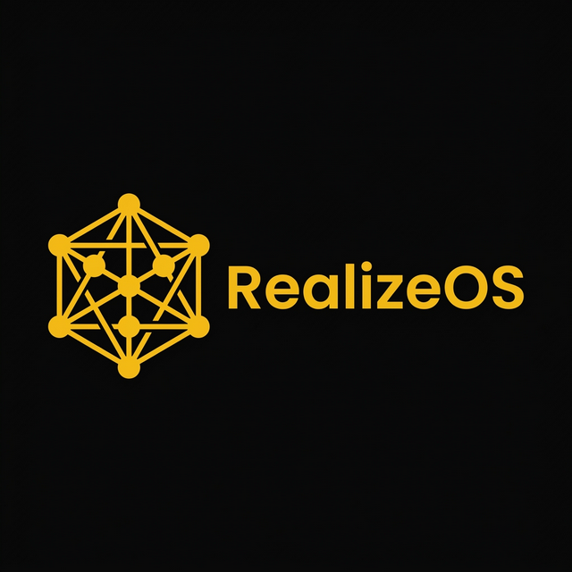

<p align="center">
  
</p>

<h1 align="center">RealizeOS</h1>

<p align="center">
  <strong>The AI operations system for your business.</strong><br/>
  Coordinated AI agents that understand your venture, remember your preferences,<br/>
  and execute multi-step workflows — not just another chatbot.
</p>

<p align="center">
  <a href="https://github.com/SufZen/RealizeOS-5/actions/workflows/ci.yml"></a>
  <a href="https://github.com/SufZen/RealizeOS-5/releases/latest"></a>
  <a href="https://pypi.org/project/realize-os/"></a>
  <a href="https://www.npmjs.com/package/@realize-os/cli"></a>
  <a href="https://ghcr.io/sufzen/realizeos-5"></a>
  <a href="LICENSE"></a>
  <a href="https://www.python.org/"></a>
  <a href="https://github.com/SufZen/RealizeOS-5/stargazers"></a>
</p>

<p align="center">
  <a href="QUICKSTART.md">⚡ Quickstart</a> ·
  <a href="docs/architecture.md">🏗️ Architecture</a> ·
  <a href="#-key-features">✨ Features</a> ·
  <a href="docs/mcp-server.md">🔌 MCP Server</a> ·
  <a href="docs/cli-reference.md">💻 CLI Reference</a> ·
  <a href="docs/self-hosting-guide.md">🚀 Self-Host</a> ·
  <a href="CONTRIBUTING.md">🤝 Contribute</a>
</p>

---

## What is RealizeOS?

RealizeOS is a **self-hosted AI operations system** that gives your business a coordinated team of AI agents. Unlike generic chatbots, RealizeOS agents **know your venture**, **run multi-step workflows**, **route to the optimal model**, and **respect governance** with approval gates and audit logs.

---

## 🆕 What's New in v5.5.0

v5.5.0 marks the **open-source relaunch** under BSL 1.1 — free core; monetize via guided installation sessions + vertical consulting. The positioning thesis:

> **You own the Heart** (FABRIC knowledge graph + event log + identity) forever; agent runtimes, models, channels, and even the dashboard are swappable adapters; local-first.

### Shipped

| Feature | What it does |
|---------|-------------|
| **FABRIC Entity System** | Markdown↔entity round-trip, provenance/trust, 3 reference mechanisms, soft JSON-Schema validation (5 entity types) |
| **Synapse Knowledge Index** | 4-tier agent memory: L1 Hot TOC, L2 FTS5 search, L3 Tool Catalog, L4 Mission Memory |
| **Event Log + SOUL** | JSONL append-only audit trail w/ SSE; persistent User/Agent identity |
| **Runtime Adapter Layer** | `AgentRuntime` Protocol, Registry w/ health polling, FABRIC REST API |
| **Mission Engine (Spine)** | 8-state mission/step machine, planning, runtime routing, cost tracking |
| **Dreaming Subsystem** | Trust Policy, Reflex + Curator cycles, Dream Inbox with human-in-the-loop |
| **Dashboard Pages** | `/missions`, `/knowledge`, `/dreams` — styled with the `@realizeos/design-system` |
| **FABRIC Operator CLI** | `realize-os fabric` — lint, reindex, stats, search, toc, dream |

### Roadmap (coming)

Voice channel (STT/TTS) · Full Workspace UI redesign · Cytoscape visual graph · React Native mobile companion · Host-satellite sync

> 📖 Full details: **[docs/v5.5.0/](docs/v5.5.0/)** · Claims verification: **[SITE-CLAIMS.md](docs/v5.5.0/SITE-CLAIMS.md)**

---

## ⚡ Quick Start

<details open>
<summary><strong>🐳 Docker (recommended)</strong></summary>

```bash
git clone https://github.com/SufZen/RealizeOS-5.git && cd RealizeOS-5
cp .env.example .env       # Add your API key(s)
docker compose up --build   # Dashboard → http://localhost:8080
```

Or standalone:
```bash
docker run -d -p 8080:8080 -v realizeos-data:/app/data ghcr.io/sufzen/realizeos-5:latest
```
</details>

<details>
<summary><strong>🐍 pip (no Docker)</strong></summary>

```bash
pip install realize-os
realize-os init --template consulting
realize-os serve
# Dashboard → http://localhost:8080
```

> Requires **Python 3.11+**. Works on Windows, macOS, and Linux.
</details>

<details>
<summary><strong>📦 NPX</strong></summary>

```bash
npx @realize-os/cli init my-business
cd my-business && npx @realize-os/cli start
```

> Requires **Node.js 18+** and **Docker**.
</details>

<details>
<summary><strong>🖥️ One-Liner Install</strong></summary>

**Linux / macOS:**
```bash
curl -fsSL https://raw.githubusercontent.com/SufZen/RealizeOS-5/main/scripts/install.sh | bash
```

**Windows (PowerShell):**
```powershell
irm https://raw.githubusercontent.com/SufZen/RealizeOS-5/main/scripts/install.ps1 | iex
```
</details>

| Method | Requires | Best For |
|--------|----------|----------|
| **Docker** | Docker | Production, isolated deployments |
| **pip** | Python 3.11+ | Local dev, no Docker needed |
| **NPX** | Node.js 18+ + Docker | Fastest project scaffolding |
| **One-liner** | bash / PowerShell | Server deployment, CI/CD |

> 📖 Full setup guide: **[QUICKSTART.md](QUICKSTART.md)** · Production: **[Self-Hosting Guide](docs/self-hosting-guide.md)**

---

## ✨ Key Features

### 🧠 FABRIC Knowledge System

Every venture's AI knowledge is organized into six layers:

| Layer | Purpose |
|-------|---------|
| **F**oundations | Venture identity, voice, core standards |
| **A**gents | AI team definitions and routing guide |
| **B**rain | Domain knowledge, market data, expertise |
| **R**outines | Skills, workflows, state maps, SOPs |
| **I**nsights | Memory: learning log, feedback, decisions |
| **C**reations | Output: deliverables, drafts, final assets |

### 🤖 Multi-LLM Routing

The engine classifies every task and selects the optimal model:

| Task Type | Model | Examples |
|-----------|-------|----------|
| Simple | Gemini Flash | Status checks, formatting, lookups |
| Content | Claude Sonnet | Writing, analysis, summarization |
| Complex | Claude Opus | Strategy, multi-step reasoning |

Providers auto-discovered at startup. Supports **Claude**, **Gemini**, **OpenAI**, and **Ollama** (local).

### 🔧 Agent System

- **Composable agents** with scope, inputs, outputs, guardrails, and tools
- **Pipelines** — sequential execution with Dev-QA retry loops
- **7 handoff types** — standard, QA-pass/fail, escalation, phase-gate, sprint, incident
- **Hot-reload** — filesystem-watched agent registry
- **Per-agent SOUL** — persistent identity: role, personality, expertise, communication style
- **Tool gating** — per-agent allowlists/denylists

### 🧩 Extension System

| Type | Purpose | Example |
|------|---------|---------|
| `tool` | New capabilities | Stripe, Twilio, custom APIs |
| `channel` | Communication | Slack, Discord, WhatsApp |
| `integration` | Backend sync | CRM, analytics |
| `hook` | Event reactions | Notifications, logging |

### 🛠️ Tool Ecosystem

| Category | Capabilities |
|----------|-------------|
| **Google Workspace** | Gmail (8 tools), Calendar (4), Drive (9), Sheets (3) |
| **Financial** | Stripe charges, subscriptions, invoices |
| **Web** | Search (Brave API), page scraping, headless browser |
| **MCP** | Connect to any MCP-compatible tool server |
| **Messaging** | Agent-to-agent bus, human notifications, channels |
| **Governance** | Human-in-the-loop approval workflows |

### 📋 Business Templates

Pre-built venture configurations:

`consulting` · `agency` · `portfolio` · `saas` · `ecommerce` · `accounting` · `coaching` · `freelance`

```bash
realize-os init --template consulting
```

---

## 🔌 MCP Server

RealizeOS ships a **built-in MCP server** so any MCP-speaking agent can use it as a second brain:

- **24 tools** across 4 families: Chat & Status, KB Read, Ops, Admin
- **HTTP+SSE transport** — works with Claude Desktop, Cursor, n8n, cloud routines
- **Same auth** — Bearer JWT or API key, same roles and audit logs
- **Gated access** — KB, ops, and admin tools independently toggleable

```bash
realize-os mcp serve --port 8080        # Start API + MCP together
realize-os mcp token --user owner       # Issue a bearer token
```

> 📖 Full details: **[docs/mcp-server.md](docs/mcp-server.md)**

---

## 💻 Operator CLI

The `realize-os` CLI is a first-class operator interface:

```bash
realize-os serve                                # Start API + dashboard
realize-os chat "What's the pipeline status?"   # Quick query
realize-os repl --system realization-il          # Interactive REPL
realize-os kb search "investment thesis"         # Search knowledge base
realize-os config profile add prod --endpoint https://my-vps:8080
```

Both `realize-os` (pip-installed) and `python cli.py` (source checkout) work identically.

> 📖 Full command reference: **[docs/cli-reference.md](docs/cli-reference.md)**

---

## 🛡️ Security & Governance

- **5-layer security middleware**: Security headers → Audit → Rate limiting → Injection guard → JWT auth
- **RBAC** with 6 roles: owner, admin, operator, user, viewer, guest
- **Prompt injection scanner** — pattern + heuristic + Unicode normalization
- **Human-in-the-loop** approval gates for consequential actions
- **Audit logging** — JSONL persistent logs with SSE streaming
- **Secret redaction** in error responses and logs

---

## 📖 Documentation

| Guide | Description |
|-------|-------------|
| [⚡ Quickstart](QUICKSTART.md) | Zero to running in 10 minutes |
| [🏗️ Architecture](docs/architecture.md) | FABRIC, message flow, modules |
| [💻 CLI Reference](docs/cli-reference.md) | Full operator CLI command tree |
| [🔌 MCP Server](docs/mcp-server.md) | Built-in MCP server: tools, security, integration |
| [📖 Getting Started](docs/getting-started.md) | First steps after setup |
| [🔧 Configuration](docs/configuration.md) | Customize your deployment |
| [🚀 Self-Hosting](docs/self-hosting-guide.md) | Production deployment |
| [✍️ Skill Authoring](docs/skill-authoring.md) | Create custom skills |
| [📡 API Reference](docs/api-reference.md) | REST + MCP API documentation |
| [📋 Upgrade from 5.0](docs/upgrade-from-v50.md) | Migration guide: 5.0.x → 5.1.0 |
| [🤝 Contributing](CONTRIBUTING.md) | Developer guide |

---

## Requirements

- **Python 3.11+** (3.12+ recommended)
- At least one LLM API key (Anthropic, Google, OpenAI, or Ollama)
- Docker 24.0+ (optional, for containerized deployment)
- Node.js 20+ (optional, for dashboard development)

---

## Community

- 🐛 [Report a Bug](https://github.com/SufZen/RealizeOS-5/issues/new?template=bug_report.md)
- 💡 [Request a Feature](https://github.com/SufZen/RealizeOS-5/issues/new?template=feature_request.md)
- 📖 [Read the Docs](docs/)
- ⭐ [Star the Repo](https://github.com/SufZen/RealizeOS-5)

---

## License

RealizeOS is licensed under the [Business Source License 1.1](LICENSE).

- ✅ Free to use, modify, and self-host
- ✅ Free for internal business operations
- ✅ Converts to Apache 2.0 on **March 26, 2030**
- ❌ Cannot offer as a hosted/managed service without a commercial license

For commercial licensing inquiries, contact [realizeos@realization.co.il](mailto:realizeos@realization.co.il).
