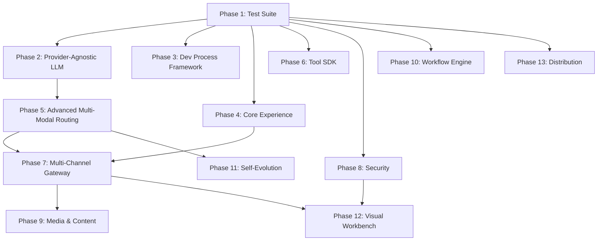

# RealizeOS Development Plan
> Product platform — Lite (local) + Full (server) tiers

## Operating Framework (Internal)

All RealizeOS development follows the `docs/dev-process/` protocol from asaf-kb-workspace:
- **Every phase** → plan in `plans/`, decisions in `decisions/`, sessions logged
- **Before work:** read `current-focus.md`, pull, update
- **After work:** update focus, log session, commit & push

---

## Tier Definitions

| | **RealizeOS Lite** | **RealizeOS Full** |
|---|---|---|
| **User** | Less technical, solo entrepreneurs | Technical, agencies, dev teams |
| **Runtime** | Obsidian vault + Claude Code/Desktop | Docker + FastAPI + Gateway |
| **Channels** | Claude CLI / Desktop only | Telegram, WhatsApp, Web, API, extensible |
| **LLM** | Single provider (Claude) | Multi-provider, multi-modal routing |
| **Dev Framework** | — | Ships with `docs/dev-process/` for guided development |

**Tags:** 🟢 Lite+Full &nbsp; 🔵 Full only &nbsp; 🟡 Lite only

---

## Dependency Graph



---

## Phase 1: Test Suite & CI 🔵 Full only

| Step | Detail |
|---|---|
| 1.1 | Complete test stubs: prompt builder, LLM router, skill detector, base handler |
| 1.2 | Add tests: creative pipeline lifecycle, KB indexer hybrid scoring |
| 1.3 | GitHub Actions CI |
| 1.4 | Target: 70%+ coverage |

**Done when:** CI green, coverage ≥70%.

---

## Phase 2: Provider-Agnostic LLM Layer 🔵 Full only
**Depends on:** Phase 1

| Step | Detail |
|---|---|
| 2.1 | `BaseLLMProvider` interface |
| 2.2 | Wrap Claude + Gemini behind interface |
| 2.3 | Add: OpenAI, DeepSeek, Grok, Ollama |
| 2.4 | Provider registry from YAML |

**Done when:** Route to any configured provider. Tests pass.

---

## Phase 3: Dev Process Framework for Users 🔵 Full only
**Depends on:** Phase 1 — Parallel with Phase 2

Ships a `docs/dev-process/` system inside every RealizeOS Full project, giving users a guided development framework for building and evolving their own system.

| Step | Detail |
|---|---|
| 3.1 | **Create `docs/dev-process/_README.md`** — session protocol (start, end, switch devices) adapted for RealizeOS users |
| 3.2 | **Create `active/current-focus.md` template** — work stream tracking with conflict zones |
| 3.3 | **Create `active/session-log.md` template** — running session history |
| 3.4 | **Create `plans/` directory** with `_template.md` — how to write a development plan |
| 3.5 | **Create `decisions/` directory** with `_template.md` — ADR template for architecture decisions |
| 3.6 | **Create `reference/` directory** — for analysis documents and external research |
| 3.7 | **Context protocols** — `project-context.md` template (the project "constitution") and session start protocol |
| 3.8 | **Dev lifecycle workflows** — planning, architecture, dev story, and code review YAML skills that integrate with the skill system |
| 3.9 | **`realize init` integration** — dev-process directory scaffolded automatically during project setup |

**Done when:** `realize init` creates a working `docs/dev-process/` with all templates. User can follow the protocol from day one.

> [!TIP]
> This is directly inspired by the proven framework in asaf-kb-workspace, productized with templates and integrated into the skill system.

---

## Phase 4: Core Experience Improvements 🟢 Lite+Full
**Depends on:** Phase 1 — Parallel with Phases 2, 3

| Step | Tier | Detail |
|---|---|---|
| 4.1 | 🟢 | Improved onboarding templates |
| 4.2 | 🟢 | Brand Worksheet upgrade |
| 4.3 | 🟢 | Curated skill library |
| 4.4 | 🟢 | `CLAUDE.md` protocol refinements |
| 4.5 | 🟢 | Method templates under `shared/methods/` |

**Done when:** Zero-to-working in 15 minutes with any template.

---

## Phase 5: Advanced Multi-Modal LLM Routing 🔵 Full only
**Depends on:** Phase 2

| Step | Detail |
|---|---|
| 5.1 | Task classifier: `text`, `code`, `image_gen`, `video_gen`, `audio`, `spreadsheet`, `reasoning` |
| 5.2 | Provider capability registry in YAML (modalities, tier, cost) |
| 5.3 | Routing engine: task → best provider+model by strategy |
| 5.4 | Fallback chains |
| 5.5 | Cost tracking per modality |
| 5.6 | Self-tuning |

**Done when:** "Generate video" → Veo, "Write post" → Flash, "Financial model" → Opus. Tests pass.

> [!IMPORTANT]
> Shared architecture with asaf-kb-workspace. Developed once, used in both systems.

---

## Phase 6: Tool SDK & Extensibility 🔵 Full only
**Depends on:** Phase 1 — Parallel with Phases 2-5

| Step | Detail |
|---|---|
| 6.1 | `BaseTool` interface |
| 6.2 | Tool discovery from YAML or directory |
| 6.3 | Refactor Google Workspace, Web, Browser as references |
| 6.4 | MCP bridge |
| 6.5 | **Docs:** "Build Your First Custom Tool" |

**Done when:** New tool via file + config entry. Reference tools work.

---

## Phase 7: Multi-Channel Gateway 🔵 Full only
**Depends on:** Phase 4, Phase 5

| Step | Detail |
|---|---|
| 7.1 | `ChannelAdapter` interface |
| 7.2 | Telegram adapter |
| 7.3 | WhatsApp adapter |
| 7.4 | Web adapter (REST + WebSocket) |
| 7.5 | Cron scheduler |
| 7.6 | Webhook ingestion |
| 7.7 | **Docs:** "Build Your Own Channel Adapter" |

**Done when:** WhatsApp and Telegram produce equivalent responses.

---

## Phase 8: Security & Multi-User 🔵 Full only
**Depends on:** Phase 1 — Parallel with 2-7

| Step | Detail |
|---|---|
| 8.1 | DM pairing flow |
| 8.2 | RBAC in YAML |
| 8.3 | Docker sandboxing |
| 8.4 | Session isolation |
| 8.5 | Prompt injection protection |

**Done when:** Unknown user blocked. Guest can't access browser. Tests pass.

---

## Phase 9: Media & Content 🟢 Lite+Full (different depth)
**Depends on:** Phase 7

| Step | Tier | Detail |
|---|---|---|
| 9.1 | 🟢 | Attachment guidance in `CLAUDE.md` |
| 9.2 | 🔵 | Image understanding via Vision |
| 9.3 | 🔵 | Voice transcription across channels |
| 9.4 | 🔵 | Auto-ingestion pipeline |
| 9.5 | 🔵 | Media generation routed to correct channel |

**Done when:** Photo on WhatsApp processed. Image gen returns result.

---

## Phase 10: Workflow Engine 🟢 Lite+Full (different depth)
**Depends on:** Phase 1 — Parallel with 2-9

| Step | Tier | Detail |
|---|---|---|
| 10.1 | 🟢 | Workflow YAML definitions |
| 10.2 | 🔵 | Programmatic runner with pluggable nodes |
| 10.3 | 🟡 | Lite manual guide |
| 10.4 | 🟢 | Method Registry |
| 10.5 | 🔵 | Webhook + cron triggers |

**Done when:** Workflow YAML executes end-to-end in Full. Lite follows manually.

---

## Phase 11: Self-Evolution 🟢 Lite+Full (different depth)
**Depends on:** Phase 5

| Step | Tier | Detail |
|---|---|---|
| 11.1 | 🟢 | Evolution suggestions in `CLAUDE.md` |
| 11.2 | 🟡 | Lite: Claude suggests, user applies |
| 11.3 | 🔵 | Auto-evolution engine |
| 11.4 | 🔵 | Audit log, rollback, rate limiting |

**Done when:** Full: auto-suggest + approve → skill created. Lite: Claude suggests text.

---

## Phase 12: Visual Workbench 🟢 Lite+Full
**Depends on:** Phase 7, Phase 8

| Step | Tier | Detail |
|---|---|---|
| 12.1 | 🟢 | Brand Worksheet wizard |
| 12.2 | 🟢 | Interactive setup |
| 12.3 | 🔵 | Gatekeeper Dashboard |
| 12.4 | 🔵 | System Management UI |
| 12.5 | 🔵 | Evolution Inbox |
| 12.6 | 🔵 | Analytics Dashboard |

**Done when:** Full: manage system from browser. Lite: generate FABRIC from wizard.

---

## Phase 13: Distribution 🟢 Lite+Full
**Depends on:** Phase 1 — Ongoing parallel track

| Step | Tier | Detail |
|---|---|---|
| 13.1 | 🟢 | `realize init` CLI (scaffolds project + dev-process/) |
| 13.2 | 🟡 | Lite: downloadable zip |
| 13.3 | 🔵 | Full: Docker Compose + guided setup |
| 13.4 | 🟢 | Skill marketplace |
| 13.5 | 🟢 | Contribution guidelines |
| 13.6 | 🟢 | Lite → Full upgrade path |

**Done when:** Install, configure, run either tier within 15 minutes.

---

## Parallel Execution Map

```
Timeline →

Phase 1  ████████
Phase 2  ·········████████
Phase 3  ·········████████                           (parallel with P2)
Phase 4  ·········████████                           (parallel with P2, P3)
Phase 6  ·········████████                           (parallel with P2, P3, P4)
Phase 8  ·········████████                           (parallel with P2-P6)
Phase 10 ·········████████                           (parallel with P2-P8)
Phase 13 ·········████████████████████████████████████ (ongoing)
Phase 5  ··················████████                  (after P2)
Phase 7  ···························████████         (after P4, P5)
Phase 11 ···························████████         (after P5, parallel P7)
Phase 9  ····································████████ (after P7)
Phase 12 ····································████████ (after P7, P8)
```

## Tier Summary

| Phase | Lite | Full |
|---|---|---|
| 1. Test Suite | — | ✅ |
| 2. Provider-Agnostic LLM | — | ✅ |
| 3. Dev Process Framework | — | ✅ |
| 4. Core Experience | ✅ | ✅ |
| 5. Advanced Routing | — | ✅ |
| 6. Tool SDK | — | ✅ |
| 7. Multi-Channel | — | ✅ |
| 8. Security | — | ✅ |
| 9. Media & Content | partial | ✅ |
| 10. Workflow Engine | partial | ✅ |
| 11. Self-Evolution | partial | ✅ |
| 12. Visual Workbench | partial | ✅ |
| 13. Distribution | ✅ | ✅ |
