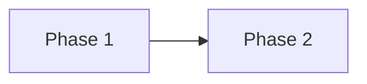

# Plan Template

> Copy this file and rename to describe your plan.
> Example: `2026-Q2-payment-integration.md`

## Goal

What is the end state? One sentence that anyone on the team can repeat.

## Context

Why now? What problem does this solve?

## Phases

### Phase 1: [Name]

| Step | Detail |
|------|--------|
| 1.1 | ... |
| 1.2 | ... |

**Done when:** [Clear success criteria]

### Phase 2: [Name]

**Depends on:** Phase 1

| Step | Detail |
|------|--------|
| 2.1 | ... |
| 2.2 | ... |

**Done when:** [Clear success criteria]

## Dependencies

## Risks

| Risk | Impact | Mitigation |
|------|--------|------------|
| ... | High/Med/Low | ... |

## Timeline

| Phase | Estimated Duration | Status |
|-------|-------------------|--------|
| Phase 1 | ... | todo |
| Phase 2 | ... | todo |
